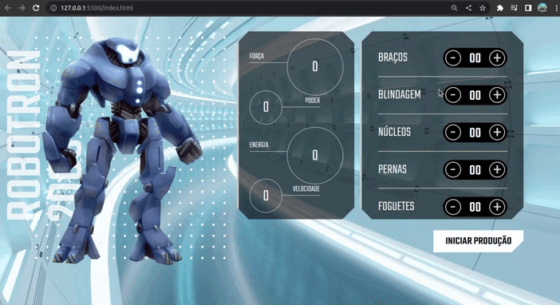

# Robotron 2000

## Sobre:

"Robotron 200" é um emocionante projeto desenvolvido em JavaScript que permite aos usuários montar seu próprio robô personalizado com atributos únicos, como força, poder, energia e velocidade.

Neste jogo interativo, os jogadores têm a oportunidade de criar e personalizar o robô dos seus sonhos, combinando diferentes componentes e atributos para melhorar suas habilidades. Eles podem escolher entre uma ampla variedade de opções, incluindo braços mecânicos poderosos, pernas velozes, armaduras resistentes e dispositivos de energia avançados.

## Layout:



## Como executar o projeto?

Os passos para acessar o projeto são bem simples, mas seguem a seguinte ordem:

```bash
# Terminal

git clone https://github.com/MateusMaciel340/robotron-2000

cd robotron-2000/

```

## Tecnologias

As seguintes ferramentas foram utilizadas na construção do projeto:

### Frontend

- HTML
- CSS
- JavaScript

## Contribuidores

<table>
    <thead>
        <tr>
            <td>
                
            </td>
        </tr>
    </thead>
    <tbody>
        <tr>
            <th>Mateus Maciel</th>
        </tr>
    </tbody>
</table>

## Como contribuir?

1. Faça um fork do projeto.
2. Crie uma nova ramificação com suas alterações: `git checkout -b minha-feature`
3. Salve as alterações e crie uma mensagem de confirmação contando o que você fez: `git commit -m "arquivo modificado"`
4. Envie suas alterações: `git push origin minha-feature`

## Licença

Este projeto é licenciado sob a licença Alura Curso